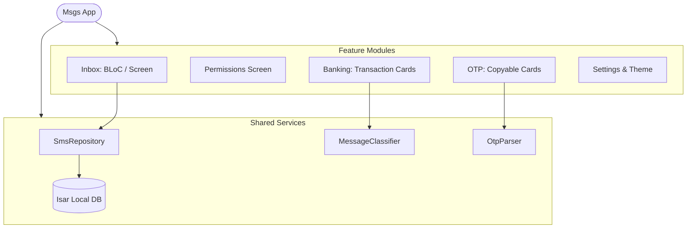

# 📱 Msgs — Smart SMS & Transaction Client

[](https://dart.dev)
[](https://flutter.dev)
[](https://isar.dev)
[](https://bloclibrary.dev)

A modern, fast, and intelligent SMS client for Android, built with **Flutter**. Msgs parses and categorizes your SMS inbox on-device, offering instant access to OTPs and visual transaction tracking with Material 3 dynamic styling.

IT IS NOT FULLY FUNCTIONAL YET. I AM DEVELOPING IT. WELL YOU CAN CHAT, WITHOUT SENDING MULTIMEDIA. AND LINKS DETECTION COMING IN THE NEXT UPDATES.

---

## 🎨 Preview


<div align="center">
  <table>
    <tr>
      <td rowspan="2" align="center" valign="top">
        <a href="https://raw.githubusercontent.com/Najeer-k11/Messages-FlutterApp/main/screenshots/chat.png">
          
        </a>
        <br>
        <b>💬 Personal Chats</b>
      </td>
      <td align="center" valign="top">
        <a href="https://raw.githubusercontent.com/Najeer-k11/Messages-FlutterApp/main/screenshots/hub.png">
          
        </a>
        <br>
        <b>🧠 Smart Inbox</b>
      </td>
      <td rowspan="2" align="center" valign="top">
        <a href="https://raw.githubusercontent.com/Najeer-k11/Messages-FlutterApp/main/screenshots/chatBubble.png">
          
        </a>
        <br>
        <b>✉️ Interactive Chat</b>
      </td>
    </tr>
    <tr>
      <td align="center" valign="top">
        <a href="https://raw.githubusercontent.com/Najeer-k11/Messages-FlutterApp/main/screenshots/notification.png">
          
        </a>
        <br>
        <b>⚡ OTP Copy Actions</b>
      </td>
    </tr>
    <tr>
      <td colspan="2" align="center" valign="top">
        <a href="https://raw.githubusercontent.com/Najeer-k11/Messages-FlutterApp/main/screenshots/settings.png">
          
        </a>
        <br>
        <b>🎨 Material You Themes</b>
      </td>
      <td align="center" valign="top">
        <a href="https://raw.githubusercontent.com/Najeer-k11/Messages-FlutterApp/main/screenshots/bubble.png">
          
        </a>
        <br>
        <b>📱 Chat Bubbles</b>
      </td>
    </tr>
  </table>
</div>

---

## ✨ Features

* **🧠 Intelligent On-Device Classification:** Automatically categorizes incoming and existing messages into:
  * 🔑 **OTPs:** One-Time Passwords from various services.
  * 💳 **Banking:** Financial credits, debits, and transaction information.
  * 💬 **Personal:** Chats and messages from contact numbers.
  * 📢 **Promotions:** Offers, discount alerts, and sales spam.
  * 🛡️ **Spam & Unknown:** Automatic filtering of unrecognized sender IDs.
* **⚡ One-Tap OTP Actions:** Detects OTP codes along with service names and expiration. Tap to copy immediately to your clipboard.
* **📊 Visual Transaction Tracker:** Extracts financial figures (INR / ₹), debits, credits, and account endings. Renders beautiful debit/credit summary cards in your inbox.
* **🎨 Dynamic Material 3 Design:** Fully supports Material You dynamic coloring (light/dark) utilizing your system color scheme.
* **💾 Local-First & High-Performance:** Uses **Isar Database** for lightning-fast offline search, caching, indexing, and sync.
* **📱 Robust OEM Permission Handling:** Gracefully handles permission lifecycles, with direct handling of default SMS handler requests and instructions for custom launchers (MIUI, HyperOS, Funtouch OS).

---

## 🏗️ Architecture

The project follows a clean **feature-driven** architecture:



### Folder Structure
* `lib/core/`: Application themes, configurations, and utilities.
* `lib/services/`: Shared repository layers, local database models, and classification engines.
* `lib/features/`: UI modules organized by user features (Inbox, Conversation, Banking, OTP, Permissions).

---

## 🛠️ Tech Stack & Dependencies

* **UI Framework:** [Flutter SDK](https://flutter.dev) (Material 3)
* **State Management:** [Flutter BLoC](https://pub.dev/packages/flutter_bloc) & [Provider](https://pub.dev/packages/provider)
* **Local Database:** [Isar](https://isar.dev) (NoSQL local database)
* **Animations:** [Flutter Animate](https://pub.dev/packages/flutter_animate)
* **Theme Styling:** [Dynamic Color](https://pub.dev/packages/dynamic_color)
* **Dependency Injection:** [Get It](https://pub.dev/packages/get_it)

---

## 🚀 Getting Started

### Prerequisites
* Flutter SDK (`>= 3.11.4`)
* Android SDK (configured for local emulation or physical devices)

### Installation Steps

1. **Clone the repository:**
   ```bash
   git clone https://github.com/Najeer-k11/Messages-FlutterApp.git
   cd Messages-FlutterApp
   ```

2. **Install dependencies:**
   ```bash
   flutter pub get
   ```

3. **Generate local database schemas (Isar):**
   This project relies on `build_runner` to generate code for the database schema models.
   ```bash
   flutter pub run build_runner build --delete-conflicting-outputs
   ```

4. **Run the application:**
   Ensure you have an Android device or emulator running.
   ```bash
   flutter run
   ```
5. **ISSUES:**
   if you face any issues while building it is mostly because of isar_flutter_libs package. I changed it in local pub package. you can change this package to community version in pub.dev.
---

## 🔒 Permissions & Safety

All message processing, categorization, and pattern parsing happens **strictly on-device**. No messages or financial details are sent to external servers, protecting your privacy.

* **SMS Permission:** Required to read local SMS storage and receive incoming messages.
* **Contacts Permission:** Used to resolve contact names from phone numbers in your threads.
* **Default SMS Handler:** Optionally prompt to set `Msgs` as the default SMS application to handle incoming SMS events.

---

## 📄 License

This project is licensed under the MIT License - see the [LICENSE](LICENSE) file for details.
